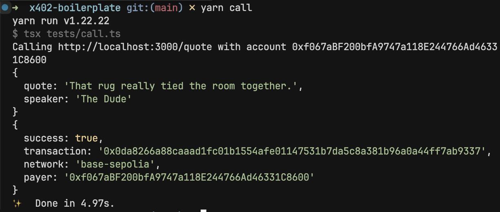

# 🚀 x402 Protocol Testing Adventure! 



> "In a world where protocols were boring, one team dared to make testing fun..." 

Welcome to the most exciting protocol testing project since someone accidentally created a meme coin! We're here to test Coinbase's shiny new x402 protocol, and we're doing it with style. 🎭

## 🎳 The Dude Abides... in Our API

That's right, fellow achievers! While we're testing this fancy x402 protocol, our API is totally laid back and delivers wisdom from The Big Lebowski. Because sometimes you need a good quote to tie the whole testing experience together, like a nice rug. 🎳

## 🤔 What's This All About?

Ever wondered what happens when you combine the reliability of Coinbase with the excitement of testing a new protocol? Well, wonder no more! This is our playground for putting the x402 protocol through its paces, finding bugs, and hopefully not creating any new cryptocurrencies by accident. And yes, the API responds with Big Lebowski quotes because... well, why not? That's just like, our opinion, man. 

## ✨ Features you won't expect in a testing project

- 🎳 Random Big Lebowski quote generator (because testing is serious, but we don't have to be)
- 🎮 Interactive testing environment
- 🚀 Built with TypeScript and Express.js
- 🐳 Docker-ready for instant deployment

## 🏃‍♂️ Quick Start

1. Clone this repo faster than you can say "blockchain":
```bash
git clone <repository-url>
cd x402-boilerplate
```

2. Install dependencies (and maybe grab a coffee):
```bash
npm install
# or if you're feeling fancy
yarn install
```

3. Create your `.env` file (promise not to peek at your keys):
```env
PORT=3000
NODE_ENV=development
# Add your super secret configuration here
```

4. Launch the testing suite:
```bash
npm run dev
# or
yarn dev
```

5. Get Your Wallet Ready (The Dude needs his digital wallet, man):

First, create a new wallet (like getting a fresh bowling ball):
```bash
# Using your favorite wallet provider (MetaMask, etc.)
# Create a new wallet and save your private key somewhere safe
# The Dude would probably write it on a bowling score sheet, but you should be more careful
```

Add your wallet details to `.env`:
```env
PRIVATE_KEY=your_private_key_here
# Don't worry, we'll keep it safer than Walter keeps his bowling ball
```

6. Test the API (The moment of truth, man):
```bash
npm run call
# or
yarn call
```

If everything works, you'll get a random Big Lebowski quote. That's how you know the protocol really ties everything together! 🎳

## 🐳 Docker Support

Because we're fancy and professional (despite our jokes), we've got Docker support! Here's how to use it:

1. Build your image (while doing your best whale impression):
```bash
docker build -t x402-api .
```

2. Run the container (and watch it swim):
```bash
docker run -p 3000:3000 -d x402-api
```

3. Want to see the logs? We've got you covered:
```bash
docker logs -f $(docker ps -q --filter ancestor=x402-api)
```

4. Need to stop the container? No problem:
```bash
docker stop $(docker ps -q --filter ancestor=x402-api)
```

Pro tip: You can also use Docker Compose if you're feeling extra sophisticated! 🎩

## ⚠️ Disclaimer

This is a serious testing project with a fun README. We take security and reliability seriously, but we believe you can have fun while doing important work!

## 📜 License

MIT License (because sharing is caring)

---

Remember: In the world of protocol testing, there are no mistakes, only "unexpected features" 😉

Made with ❤️ and probably too much caffeine by [turinglabs](https://turinglabs.org)